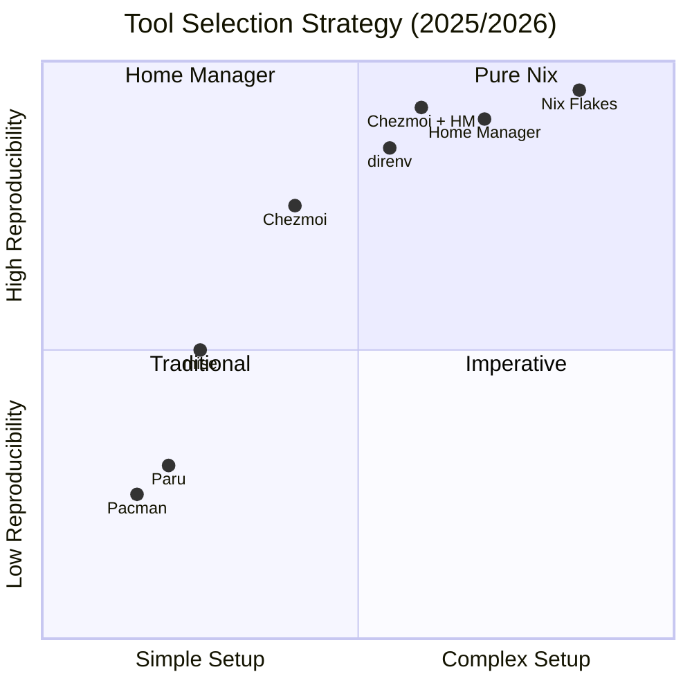
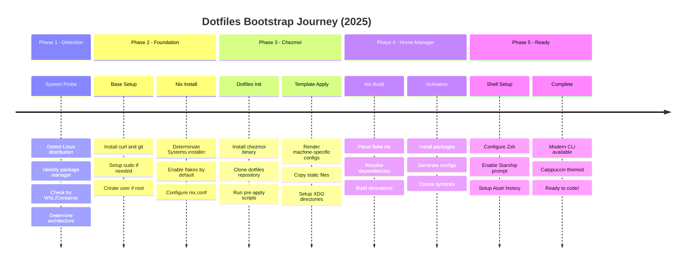
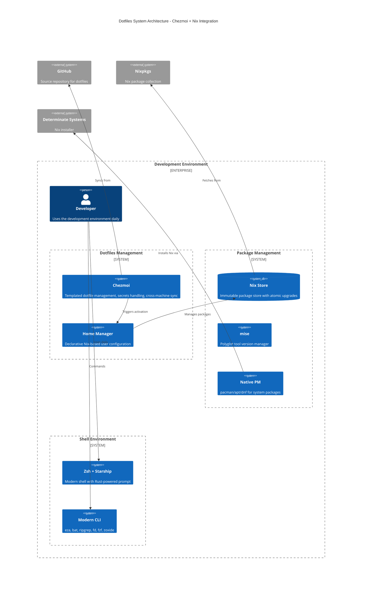
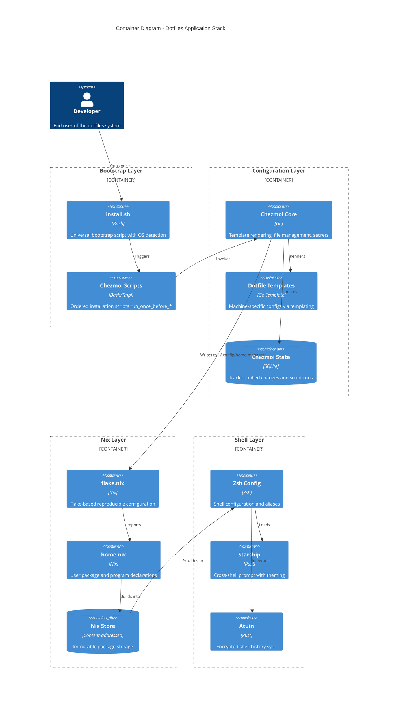
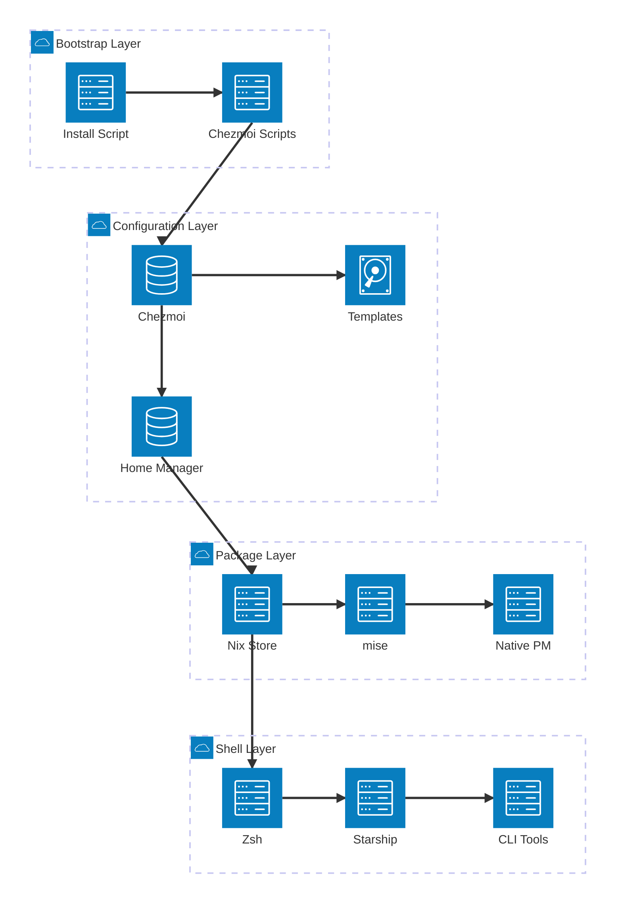
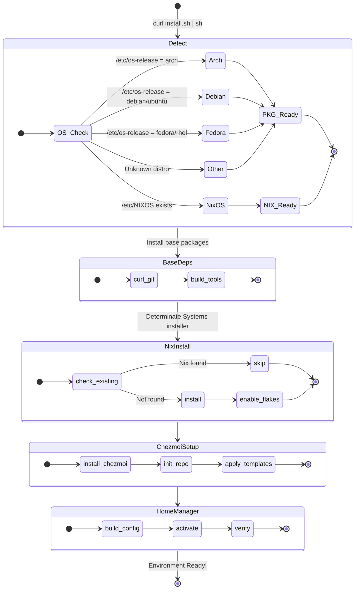
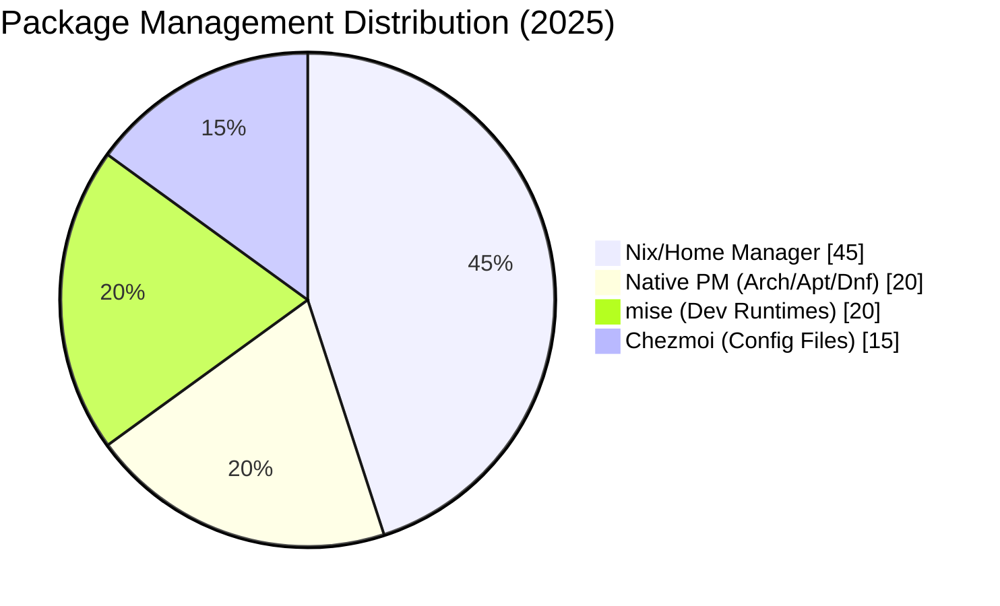

<div align="center">


# 🏠 Yuzu's Dotfiles

### *Infrastructure as Code for Development Environments (2025/2026)*

*Managed with [Chezmoi](https://chezmoi.io) ❄️ • Declarative with [Nix](https://nixos.org) + [Home Manager](https://nix-community.github.io/home-manager/) 🤖 • Themed with [Catppuccin](https://catppuccin.com) 🎨*

<br/>

[](https://kernel.org/)
[](https://archlinux.org/)
[](https://ubuntu.com/)
[](https://fedoraproject.org/)
[](https://www.opensuse.org/)
[](https://alpinelinux.org/)

[](https://docs.microsoft.com/en-us/windows/wsl/)
[](https://nixos.org/)
[](https://nix-community.github.io/home-manager/)
[](https://deepwiki.com/Yuzu02/dotfiles)

[](https://chezmoi.io/)
[](https://www.zsh.org/)
[](https://starship.rs/)
[](https://catppuccin.com/)

<br/>

[](LICENSE)
[](https://github.com/Yuzu02/dotfiles/stargazers)
[](https://github.com/Yuzu02/dotfiles/commits)
[](https://www.zsh.org/)

---

**[📖 Overview](#-overview)** •
**[🚀 Quick Start](#-quick-start)** •
**[🏗️ Architecture](#%EF%B8%8F-architecture)** •
**[🧰 Tool Stack](#-tool-stack)** •
**[📁 Structure](#-directory-structure)** •
**[⚙️ Configuration](#%EF%B8%8F-configuration)**

</div>

---

## 📑 Table of Contents

<details>
<summary><b>Click to expand</b></summary>

- [📖 Overview](#-overview)
  - [✨ Features](#-features)
  - [🎯 Design Principles](#-design-principles)
- [🚀 Quick Start](#-quick-start)
  - [One-Line Bootstrap](#one-line-bootstrap)
  - [Manual Installation](#manual-installation)
- [🏗️ Architecture](#%EF%B8%8F-architecture)
  - [System Architecture (C4 Context)](#system-architecture-c4-context)
  - [Container Diagram](#container-diagram)
  - [Architecture Diagram](#architecture-diagram)
  - [Bootstrap Sequence](#bootstrap-sequence)
  - [State Machine](#state-machine)
  - [Timeline](#timeline)
  - [Gantt Chart](#gantt-chart)
- [🧰 Tool Stack](#-tool-stack)
  - [Tool Selection Matrix](#tool-selection-matrix)
  - [Package Distribution](#package-distribution)
  - [Complete Tool List](#complete-tool-list)
- [📁 Directory Structure](#-directory-structure)
  - [Repository Layout](#repository-layout)
  - [File Mapping](#file-mapping)
- [⚙️ Configuration](#%EF%B8%8F-configuration)
  - [Initial Setup Prompts](#initial-setup-prompts)
  - [Environment Detection](#environment-detection)
- [🎨 Theme: Catppuccin Mocha](#-theme-catppuccin-mocha)
- [⌨️ Key Bindings](#%EF%B8%8F-key-bindings)
- [🔄 Daily Usage](#-daily-usage)
- [🛠️ Maintenance](#%EF%B8%8F-maintenance)
- [🔧 Troubleshooting](#-troubleshooting)
- [🤝 Acknowledgements](#-acknowledgements)
- [📄 License](#-license)

</details>

---

## 📖 Overview

This repository contains my personal dotfiles and system configurations, managed as **Infrastructure as Code** for **maximum reproducibility**. A single command bootstraps a fresh **Linux** installation with all my tools, configurations, and preferences using the power of **Chezmoi + Nix Home Manager** integration.

### ✨ Features

| Feature | Description |
|:--------|:------------|
| 🔄 **Reproducible** | Same environment on any machine via Nix + Home Manager |
| 🐧 **Universal Linux** | Works on Arch, Ubuntu, Debian, Fedora, openSUSE, Alpine, and more |
| 🔐 **Templated** | Machine-specific configs and secrets handled safely via Chezmoi |
| 🚀 **One Command Setup** | Single command setup from fresh install to ready-to-code |
| 📦 **Hybrid Management** | Chezmoi for dotfiles + Home Manager for packages |
| 🎨 **Themed** | Consistent Catppuccin Mocha across all 40+ tools |
| ⚡ **Modern CLI** | Rust-based replacements for classic Unix tools |
| 🏠 **Declarative** | Nix flakes for reproducible, rollback-able configuration |
| ❄️ **Nix Flakes** | Modern Nix with flakes enabled by default |

### 🎯 Design Principles



| # | Principle | Implementation |
|:-:|:----------|:---------------|
| 1️⃣ | **Reproducibility First** | Nix + Home Manager ensures byte-for-byte identical environments |
| 2️⃣ | **Hybrid Management** | Chezmoi handles templates/secrets, Home Manager handles packages |
| 3️⃣ | **Universal Compatibility** | Determinate Systems Nix installer works on any Linux distro |
| 4️⃣ | **Modern Performance** | Rust-based tools (starship, atuin, eza, bat, ripgrep) |
| 5️⃣ | **Minimal Friction** | Auto-activation via chezmoi run_onchange scripts |

---

## 🚀 Quick Start

### One-Line Bootstrap

```bash
# 🔥 Universal Linux bootstrap - works on ANY distro!
# Arch, Ubuntu, Debian, Fedora, openSUSE, Alpine, WSL2...
sh -c "$(curl -fsLS get.chezmoi.io)" -- init --apply Yuzu02

# Or with custom options:
curl -fsLS https://raw.githubusercontent.com/Yuzu02/dotfiles/master/install.sh | bash
```

> **✨ Fully Automatic:** Detects your distribution, installs Nix via Determinate Systems installer, sets up Home Manager, and configures everything with a single command!

### Supported Distributions

| Distribution | Package Manager | Nix Support | Status |
|:-------------|:----------------|:------------|:-------|
| 🔵 **Arch Linux** | pacman/paru/yay | ✅ | Fully Supported |
| 🟠 **Ubuntu/Debian** | apt-get | ✅ | Fully Supported |
| 🔴 **Fedora/RHEL** | dnf | ✅ | Fully Supported |
| 🟢 **openSUSE** | zypper | ✅ | Fully Supported |
| 🔷 **Alpine Linux** | apk | ✅ | Fully Supported |
| 🟣 **Void Linux** | xbps | ✅ | Fully Supported |
| ⬜ **NixOS** | nix | Native | Fully Supported |
| 🪟 **WSL2** | Any of above | ✅ | Fully Supported |

### What Happens Automatically



### Manual Installation

```bash
# 1️⃣ Install Nix (via Determinate Systems - recommended for 2025)
curl --proto '=https' --tlsv1.2 -sSf -L https://install.determinate.systems/nix | sh -s -- install

# 2️⃣ Install chezmoi
nix profile install nixpkgs#chezmoi

# 3️⃣ Initialize dotfiles
chezmoi init https://github.com/Yuzu02/dotfiles.git

# 4️⃣ Preview changes
chezmoi diff

# 5️⃣ Apply (triggers Home Manager automatically)
chezmoi apply -v
```

---

## 🏗️ Architecture

### System Architecture (C4 Context)



### Container Diagram



### Architecture Diagram



### Bootstrap Sequence

```mermaid
sequenceDiagram
    autonumber
    
    actor User as 👤 Developer
    participant Install as 📜 install.sh
    participant System as 🐧 Linux System
    participant Nix as ❄️ Nix/Home Manager
    participant Chezmoi as 🏠 Chezmoi
    participant HM as 📦 Home Manager
    
    rect rgb(49, 50, 68)
        Note over User,HM: Phase 1: System Detection & Bootstrap
        User->>Install: curl install.sh | sh
        Install->>System: Detect OS (arch/ubuntu/fedora...)
        Install->>System: Detect environment (WSL/Container)
        System-->>Install: OS info + architecture
        Install->>System: Install base dependencies (curl, git)
    end
    
    rect rgb(30, 102, 145)
        Note over Install,Nix: Phase 2: Nix Installation
        Install->>Nix: curl determinate.systems/nix
        Nix->>System: Install Nix daemon
        Nix->>System: Enable flakes + nix-command
        Nix-->>Install: Nix ready
    end
    
    rect rgb(137, 180, 250)
        Note over Install,Chezmoi: Phase 3: Chezmoi Setup
        Install->>Chezmoi: Install chezmoi
        Chezmoi->>Chezmoi: chezmoi init Yuzu02/dotfiles
        Chezmoi->>System: Run pre-scripts (00-05)
        Chezmoi->>System: Apply dotfile templates
        Chezmoi->>System: Write ~/.config/home-manager/*
    end
    
    rect rgb(166, 227, 161)
        Note over Chezmoi,HM: Phase 4: Home Manager Activation
        Chezmoi->>HM: Trigger run_onchange script
        HM->>Nix: nix run home-manager -- switch
        Nix->>Nix: Build flake configuration
        Nix->>System: Install packages to Nix store
        HM->>System: Activate generation
        HM-->>User: Environment ready!
    end
    
    rect rgb(203, 166, 247)
        Note over User,HM: Daily Usage
        User->>Chezmoi: chezmoi update
        Chezmoi->>HM: Detect config changes
        HM->>Nix: Rebuild if needed
        Nix-->>User: Updated environment
    end
```



### State Machine



### Gantt Chart

```mermaid
gantt
    title Dotfiles Bootstrap Timeline (Estimated Duration)
    dateFormat X
    axisFormat %s seconds
    
    section Detection
        Detect OS          :done, detect, 0, 1
        Detect WSL         :done, wsl, 1, 1
        Check Architecture :done, arch, 2, 1
    
    section Base Setup
        Install curl/git       :active, curl, 3, 3
        Sudo Configuration     :sudo, after curl, 2
        Package Manager Update :pkgupd, after sudo, 5
    
    section Nix Installation
        Download Installer     :nixdl, after pkgupd, 3
        Install Nix Daemon     :nixinst, after nixdl, 15
        Enable Flakes          :flakes, after nixinst, 2
    
    section Chezmoi Setup
        Install Chezmoi        :cz, after flakes, 3
        Clone Repository       :clone, after cz, 5
        Run Pre-Scripts        :scripts, after clone, 20
        Apply Templates        :apply, after scripts, 5
    
    section Home Manager
        Initial Build          :crit, hmbuild, after apply, 60
        Package Installation   :crit, hmpkgs, after hmbuild, 30
        Activation             :hmact, after hmpkgs, 5
    
    section Finalization
        Shell Configuration    :shell, after hmact, 3
        Verification           :verify, after shell, 2
        Ready                  :milestone, done, after verify, 0
```



---

## 🧰 Tool Stack

### Tool Selection Matrix

| Layer | Tool | Purpose | Why This Choice? |
|:------|:-----|:--------|:-----------------|
| **Installer** | Determinate Systems | Nix installation | Works on any distro, SELinux compatible, better uninstall |
| **Dotfiles** | `chezmoi` | Config management | Templates, secrets, one-command deploy |
| **Packages** | `Home Manager` | Declarative packages | Reproducible, rollbacks, Catppuccin integration |
| **Dev Tools** | `mise` | Runtime management | 15x faster than asdf (Rust vs Bash) |
| **Shell** | `zsh` + `starship` | Interactive shell | POSIX compatible, fastest prompt (Rust) |
| **History** | `atuin` | Shell history | Encrypted sync, fuzzy search |

### Package Distribution



### Complete Tool List

<details>
<summary><b>🐚 Shell & Navigation</b></summary>

| Tool | Replaces | Description |
|:-----|:---------|:------------|
| `zsh` | bash | Primary shell with Oh My Zsh |
| `starship` | PS1 | Cross-shell prompt (Rust) |
| `atuin` | history | Shell history sync & search |
| `zoxide` | cd | Smart directory jumping |
| `fzf` | - | Fuzzy finder |
| `carapace` | completions | Universal shell completions |

</details>

<details>
<summary><b>📁 File Operations</b></summary>

| Tool | Replaces | Description |
|:-----|:---------|:------------|
| `eza` | ls | Modern listing with icons |
| `bat` | cat | Syntax highlighting |
| `ripgrep` | grep | 10x faster search |
| `fd` | find | User-friendly find |
| `yazi` | ranger | Terminal file manager |
| `dust` | du | Visual disk usage |
| `duf` | df | Beautiful disk free |

</details>

<details>
<summary><b>🔧 Development</b></summary>

| Tool | Purpose | Description |
|:-----|:--------|:------------|
| `mise` | Runtimes | Tool version manager |
| `neovim` | Editor | Modal text editor |
| `lazygit` | Git | Git TUI |
| `delta` | Diff | Git diff viewer |
| `direnv` | Env | Auto-load environments |

</details>

<details>
<summary><b>🖥️ System & Monitoring</b></summary>

| Tool | Replaces | Description |
|:-----|:---------|:------------|
| `btop` | top | System monitor |
| `procs` | ps | Process viewer |
| `zellij` | tmux | Terminal multiplexer |
| `fastfetch` | neofetch | System info |

</details>

<details>
<summary><b>📦 Languages (via mise)</b></summary>

| Runtime | Description |
|:--------|:------------|
| `bun` | JavaScript runtime & toolkit |
| `node` | Node.js LTS |
| `uv` | Python package manager |

</details>

---

## 📁 Directory Structure

### Repository Layout

```
📦 dotfiles/
├── 📜 install.sh              # Bootstrap script
├── 📖 README.md               # This file
├── 📝 .chezmoiroot            # Points to home/
│
└── 🏠 home/                   # Source directory
    ├── ⚙️ .chezmoi.toml.tmpl  # Chezmoi config template
    ├── 🚫 .chezmoiignore      # Ignored files
    │
    ├── 📜 .chezmoiscripts/    # Install scripts
    │   ├── 00-setup-arch-fresh.sh.tmpl
    │   ├── 01-install-dependencies.sh.tmpl
    │   ├── 02-install-nix.sh.tmpl
    │   ├── 03-install-shell-tools.sh.tmpl
    │   ├── 04-install-modern-cli.sh.tmpl
    │   └── 05-install-dev-tools.sh.tmpl
    │
    ├── 📄 dot_zshrc.tmpl      # Zsh configuration
    ├── 📄 dot_gitconfig.tmpl  # Git configuration
    │
    └── 📁 dot_config/         # ~/.config/
        ├── 📁 atuin/          # Shell history
        ├── 📁 bat/            # Cat replacement
        ├── 📁 btop/           # System monitor
        ├── 📁 fastfetch/      # System info
        ├── 📁 home-manager/   # Nix Home Manager
        │   ├── flake.nix
        │   ├── home.nix
        │   └── home-minimal.nix
        ├── 📁 mise/           # Dev tool manager
        ├── 📁 nushell/        # Modern shell
        ├── 📁 starship/       # Prompt
        └── 📁 zellij/         # Multiplexer
```

### File Mapping

| Source (chezmoi) | Target (system) | Description |
|:-----------------|:----------------|:------------|
| `dot_zshrc.tmpl` | `~/.zshrc` | Zsh with templating |
| `dot_gitconfig.tmpl` | `~/.gitconfig` | Git config (WSL-aware) |
| `dot_config/starship/` | `~/.config/starship/` | Starship prompt |
| `dot_config/atuin/` | `~/.config/atuin/` | Shell history sync |
| `dot_config/zellij/` | `~/.config/zellij/` | Terminal multiplexer |
| `dot_config/nushell/` | `~/.config/nushell/` | Nushell config |
| `dot_config/bat/` | `~/.config/bat/` | Bat configuration |
| `dot_config/btop/` | `~/.config/btop/` | System monitor |
| `dot_config/fastfetch/` | `~/.config/fastfetch/` | System info |
| `dot_config/mise/` | `~/.config/mise/` | Dev tool manager |
| `dot_config/home-manager/` | `~/.config/home-manager/` | Nix Home Manager |

---

## ⚙️ Configuration

### Initial Setup Prompts

When running `chezmoi init`, you'll be prompted for:

| Variable | Description | Example |
|:---------|:------------|:--------|
| `name` | Your full name | `Yuzu` |
| `email` | Your email | `yuzu@example.com` |
| `github_user` | GitHub username | `Yuzu02` |

### Environment Detection

Chezmoi automatically detects:

| Environment | Detection Method | Effect |
|:------------|:-----------------|:-------|
| **WSL** | Kernel version contains "microsoft" | Windows clipboard, paths |
| **Codespaces** | `CODESPACES` env var | Minimal install mode |
| **DevContainer** | `REMOTE_CONTAINERS` env var | Minimal install mode |
| **Root User** | `id -u` equals 0 | Skip sudo, install it first |

---

## 🎨 Theme: Catppuccin Mocha

All tools are configured with the **Catppuccin Mocha** color scheme:

| Element | Color | Hex |
|:--------|:------|:----|
| 🟫 Background | Crust | `#11111b` |
| ⬛ Surface | Base | `#1e1e2e` |
| ⬜ Foreground | Text | `#cdd6f4` |
| 🔴 Red | Red | `#f38ba8` |
| 🟢 Green | Green | `#a6e3a1` |
| 🟡 Yellow | Yellow | `#f9e2af` |
| 🔵 Blue | Blue | `#89b4fa` |
| 🟣 Mauve | Mauve | `#cba6f7` |

---

## ⌨️ Key Bindings

<details>
<summary><b>🐚 Zsh (with fzf)</b></summary>

| Keybinding | Action |
|:-----------|:-------|
| `Ctrl+R` | History search (atuin) |
| `Ctrl+T` | File fuzzy finder |
| `Alt+C` | Directory fuzzy finder |
| `Ctrl+/` | Toggle preview |

</details>

<details>
<summary><b>🖥️ Zellij</b></summary>

| Keybinding | Action |
|:-----------|:-------|
| `Ctrl+G` | Lock/Unlock mode |
| `Ctrl+P` | Pane mode |
| `Ctrl+T` | Tab mode |
| `Ctrl+N` | Resize mode |
| `Ctrl+H` | Move mode |
| `Ctrl+S` | Scroll mode |
| `Ctrl+O` | Session mode |
| `Ctrl+Q` | Quit |

</details>

<details>
<summary><b>📝 Git Aliases</b></summary>

| Alias | Command |
|:------|:--------|
| `gs` | `git status -sb` |
| `gaa` | `git add --all` |
| `gcm` | `git commit -m` |
| `gp` | `git push` |
| `gpl` | `git pull` |
| `gl` | `git log --oneline --graph` |
| `lg` | `lazygit` |

</details>

---

## 🔄 Daily Usage

```bash
# 📥 Update dotfiles from remote
chezmoi update

# ✏️ Edit a dotfile
chezmoi edit ~/.zshrc

# 👀 See what would change
chezmoi diff

# ✅ Apply changes
chezmoi apply

# ➕ Add a new file to chezmoi
chezmoi add ~/.config/new-tool/config

# 🔄 Re-run install scripts
chezmoi state delete-bucket --bucket=scriptState
chezmoi apply
```

---

## 🛠️ Maintenance

### Update System

```bash
# Full system update
paru -Syu                    # System packages
mise upgrade                 # Dev tools
chezmoi update               # Dotfiles
home-manager switch          # Nix packages

# Cleanup
paru -Sc                     # Package cache
paru -Rns $(paru -Qtdq)     # Orphans
nix-collect-garbage -d       # Nix store
```

### Backup Checklist

```bash
# Dotfiles (auto-backed up)
chezmoi cd && git push

# Export tool lists
mise ls > ~/mise-tools.txt
pacman -Qqe > ~/pacman-packages.txt
```

---

## 🔧 Troubleshooting

<details>
<summary><b>🚫 "sudo: command not found" on fresh install</b></summary>

This is expected on fresh Linux installations. The scripts now handle this automatically by:

1. Detecting if running as root
2. Detecting your Linux distribution
3. Installing sudo and build tools using the appropriate package manager
4. Configuring the wheel (Arch/Fedora) or sudo (Ubuntu) group

If you still encounter issues:

**Arch Linux:**

```bash
# As root
pacman -S sudo base-devel
echo "%wheel ALL=(ALL:ALL) ALL" > /etc/sudoers.d/wheel
```

**Ubuntu/Debian:**

```bash
# As root
apt-get update && apt-get install -y sudo
usermod -aG sudo your_username
```

**Fedora/RHEL:**

```bash
# As root
dnf install -y sudo
usermod -aG wheel your_username
```

</details>

<details>
<summary><b>📦 Package not found on my distro</b></summary>

Some packages have different names across distributions:

| Tool | Arch | Ubuntu/Debian | Fedora |
|:-----|:-----|:--------------|:-------|
| **fd** | fd | fd-find | fd-find |
| **bat** | bat | bat | bat |
| **carapace** | carapace | (install from GitHub) | (install from copr) |
| **eza** | eza | (cargo install) | eza |

The scripts handle these differences automatically. If a package fails:

```bash
# Check what failed
journalctl -xe

# Install manually
cargo install <package>  # For Rust tools
```

</details>

<details>
<summary><b>🔄 mise not activating</b></summary>

```bash
# Verify in ~/.zshrc
grep "mise activate" ~/.zshrc

# Should show:
# eval "$(mise activate zsh)"

# Re-source
source ~/.zshrc

# Test
mise doctor
```

</details>

<details>
<summary><b>❄️ Nix Flake issues</b></summary>

```bash
# Git must track flake.nix
git add flake.nix

# Clear cache
rm -rf ~/.cache/nix

# Check flake
nix flake check
```

</details>

<details>
<summary><b>🐌 Slow shell startup</b></summary>

```bash
# Profile startup time
time zsh -i -c exit

# Profile in detail
zsh -xv &> zsh_profile.log
```

</details>

---

## 🤝 Acknowledgements

Inspired by:

| Project | Inspiration |
|:--------|:------------|
| [twpayne/dotfiles](https://github.com/twpayne/dotfiles) | Chezmoi author's dotfiles |
| [budimanjojo/nix-config](https://github.com/budimanjojo/nix-config) | NixOS + Chezmoi structure |
| [Catppuccin](https://github.com/catppuccin/catppuccin) | Beautiful color scheme |

---

## 📄 License

MIT License - Feel free to use and modify!

---

<div align="center">

**[⬆ Back to Top](#-yuzus-dotfiles)**

<br/>

Made with ❤️ by **Yuzu**

<br/>

[](https://github.com/Yuzu02)

</div>
