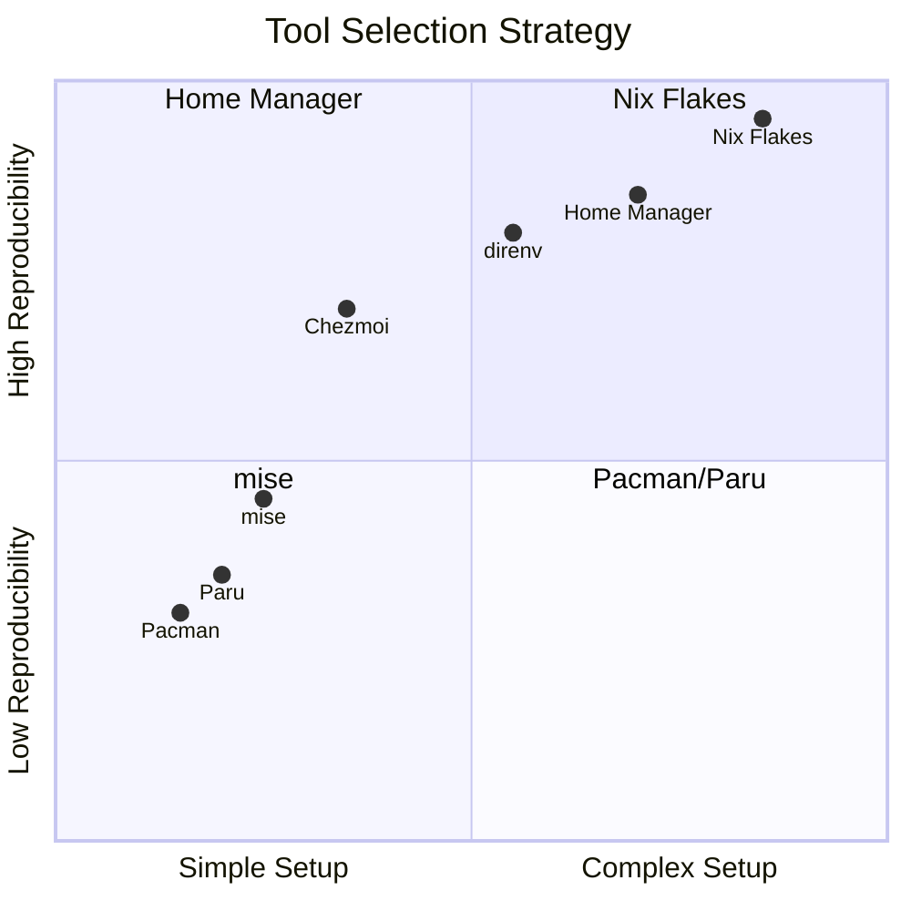
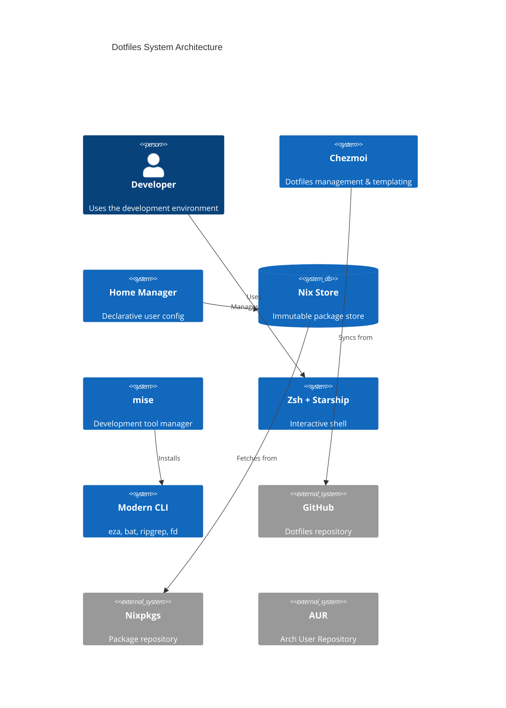
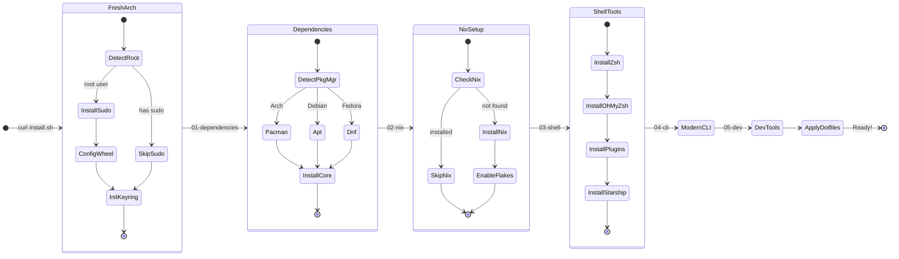
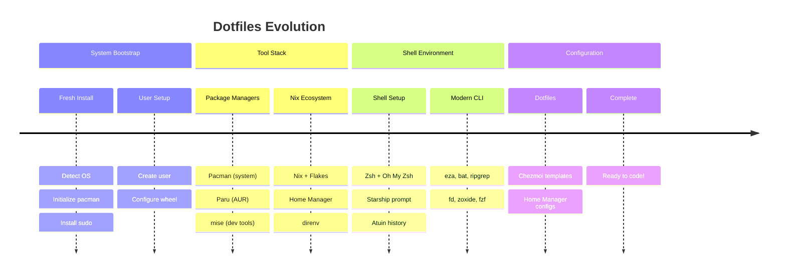
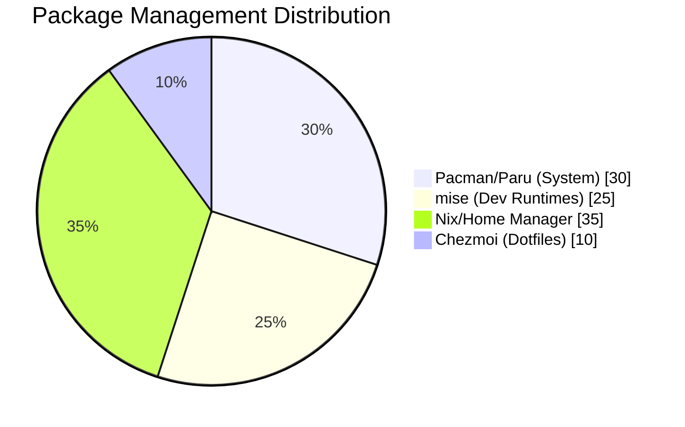

<div align="center">


# 🏠 Yuzu's Dotfiles

### *Infrastructure as Code for Development Environments*

*Managed with [Chezmoi](https://chezmoi.io) ❄️ • Declarative with [Nix](https://nixos.org) 🤖 • Themed with [Catppuccin](https://catppuccin.com) 🎨*

<br/>

[](https://archlinux.org/)
[](https://docs.microsoft.com/en-us/windows/wsl/)
[](https://nixos.org/)
[](https://nix-community.github.io/home-manager/)

[](https://chezmoi.io/)
[](https://www.zsh.org/)
[](https://starship.rs/)
[](https://catppuccin.com/)

<br/>

[](LICENSE)
[](https://github.com/Yuzu02/dotfiles/stargazers)
[](https://github.com/Yuzu02/dotfiles/commits)
[](https://www.zsh.org/)

---

**[📖 Overview](#-overview)** •
**[🚀 Quick Start](#-quick-start)** •
**[🏗️ Architecture](#%EF%B8%8F-architecture)** •
**[🧰 Tool Stack](#-tool-stack)** •
**[📁 Structure](#-directory-structure)** •
**[⚙️ Configuration](#%EF%B8%8F-configuration)**

</div>

---

## 📑 Table of Contents

<details>
<summary><b>Click to expand</b></summary>

- [📖 Overview](#-overview)
  - [✨ Features](#-features)
  - [🎯 Design Principles](#-design-principles)
- [🚀 Quick Start](#-quick-start)
  - [One-Line Bootstrap](#one-line-bootstrap)
  - [Manual Installation](#manual-installation)
- [🏗️ Architecture](#%EF%B8%8F-architecture)
  - [System Architecture (C4)](#system-architecture-c4)
  - [Bootstrap Sequence](#bootstrap-sequence)
  - [State Machine](#state-machine)
  - [Timeline](#timeline)
- [🧰 Tool Stack](#-tool-stack)
  - [Tool Selection Matrix](#tool-selection-matrix)
  - [Package Distribution](#package-distribution)
  - [Complete Tool List](#complete-tool-list)
- [📁 Directory Structure](#-directory-structure)
  - [Repository Layout](#repository-layout)
  - [File Mapping](#file-mapping)
- [⚙️ Configuration](#%EF%B8%8F-configuration)
  - [Initial Setup Prompts](#initial-setup-prompts)
  - [Environment Detection](#environment-detection)
- [🎨 Theme: Catppuccin Mocha](#-theme-catppuccin-mocha)
- [⌨️ Key Bindings](#%EF%B8%8F-key-bindings)
- [🔄 Daily Usage](#-daily-usage)
- [🛠️ Maintenance](#%EF%B8%8F-maintenance)
- [🔧 Troubleshooting](#-troubleshooting)
- [🤝 Acknowledgements](#-acknowledgements)
- [📄 License](#-license)

</details>

---

## 📖 Overview

This repository contains my personal dotfiles and system configurations, managed as **Infrastructure as Code** for **maximum reproducibility**. A single command bootstraps a fresh **Arch Linux** or **WSL2** installation with all my tools, configurations, and preferences.

### ✨ Features

| Feature | Description |
|:--------|:------------|
| 🔄 **Reproducible** | Same environment on any machine, byte-for-byte identical |
| 🔐 **Templated** | Machine-specific configs and secrets handled safely |
| 🚀 **Fast Bootstrap** | Single command setup, works from fresh root install |
| 🌐 **Cross-Platform** | Arch Linux, Ubuntu, Fedora, WSL2 support |
| 📦 **Layered** | Right tool for the right job (Pacman → mise → Nix) |
| 🎨 **Themed** | Consistent Catppuccin Mocha across all tools |
| ⚡ **Modern CLI** | Rust-based replacements for classic Unix tools |
| 🏠 **Declarative** | Home Manager for reproducible user configuration |

### 🎯 Design Principles



| # | Principle | Implementation |
|:-:|:----------|:---------------|
| 1️⃣ | **Reproducibility First** | Every tool and config is version-controlled |
| 2️⃣ | **Single Source of Truth** | All configuration lives in Git |
| 3️⃣ | **Layered Management** | Right tool for the right job |
| 4️⃣ | **Modern Performance** | Rust-based tools where possible |
| 5️⃣ | **Minimal Friction** | Auto-activation, smart defaults |

---

## 🚀 Quick Start

### One-Line Bootstrap

```bash
# 🔥 Fresh Arch/WSL install - works even as root without sudo!
sh -c "$(curl -fsLS get.chezmoi.io)" -- init --apply Yuzu02
```

> **Note:** This works on fresh Arch installations running as root. The scripts automatically detect the environment and handle sudo installation.

### Manual Installation

```bash
# 1️⃣ Install chezmoi
sudo pacman -S chezmoi  # Arch
# or
curl -fsLS get.chezmoi.io | sh  # Universal

# 2️⃣ Initialize dotfiles
chezmoi init https://github.com/Yuzu02/dotfiles.git

# 3️⃣ Preview changes
chezmoi diff

# 4️⃣ Apply
chezmoi apply -v
```

---

## 🏗️ Architecture

### System Architecture (C4)



### Bootstrap Sequence

```mermaid
sequenceDiagram
    autonumber
    participant User as 👤 User
    participant Install as 📜 install.sh
    participant Chezmoi as 🏠 Chezmoi
    participant Scripts as ⚙️ Scripts
    participant System as 🐧 System

    rect rgb(49, 50, 68)
        Note over User,System: Bootstrap Phase
        User->>Install: curl install.sh | sh
        Install->>Install: Detect OS & WSL
        Install->>Chezmoi: Install chezmoi
        Chezmoi->>Chezmoi: chezmoi init --apply
    end

    rect rgb(30, 102, 145)
        Note over Chezmoi,System: Configuration Phase
        Chezmoi->>Scripts: 00-setup-arch-fresh
        Scripts->>System: pacman-key --init
        Scripts->>System: Install sudo, base-devel
        Chezmoi->>Scripts: 01-install-dependencies
        Scripts->>System: Core packages
    end

    rect rgb(166, 227, 161)
        Note over Chezmoi,System: Tool Installation
        Chezmoi->>Scripts: 02-install-nix
        Scripts->>System: Nix + Flakes
        Chezmoi->>Scripts: 03-install-shell-tools
        Scripts->>System: zsh, starship, atuin
        Chezmoi->>Scripts: 04-install-modern-cli
        Scripts->>System: eza, bat, ripgrep, fd
        Chezmoi->>Scripts: 05-install-dev-tools
        Scripts->>System: mise, bun, node, uv
    end

    rect rgb(203, 166, 247)
        Note over Chezmoi,System: Dotfiles Application
        Chezmoi->>System: Apply templates
        Chezmoi->>System: Copy configs
        System-->>User: ✅ Environment Ready!
    end
```



### State Machine



### Timeline



### Bootstrap Timeline (Gantt)

```mermaid
gantt
    title Dotfiles Bootstrap Timeline
    dateFormat X
    axisFormat %s
    
    section System Setup
        Detect OS & Environment    :done, detect, 0, 2
        Initialize Pacman Keys     :done, keys, after detect, 3
        Install sudo & base-devel  :done, sudo, after keys, 5
    
    section Package Installation
        Core Dependencies          :active, deps, after sudo, 4
        Nix + Flakes              :nix, after deps, 6
        Shell Tools (zsh, starship):shell, after nix, 5
        Modern CLI Tools          :cli, after shell, 4
        Dev Tools (mise, bun)     :dev, after cli, 3
    
    section Configuration
        Apply Dotfile Templates    :config, after dev, 3
        Setup Home Manager        :hm, after config, 4
        Final Configuration       :final, after hm, 2
```



---

## 🧰 Tool Stack

### Tool Selection Matrix

| Layer | Tool | Purpose | Why Not Alternative? |
|:------|:-----|:--------|:---------------------|
| **System** | `pacman` + `paru` | System packages | Native, fastest, bleeding edge |
| **Dev Tools** | `mise` | Runtime management | 15x faster than asdf (Rust vs Bash) |
| **Declarative** | `Nix` + `Home Manager` | Reproducible config | True reproducibility, rollbacks |
| **Dotfiles** | `chezmoi` | Config management | Templates, secrets, one-command deploy |
| **Shell** | `zsh` + `starship` | Interactive shell | POSIX compatible, fastest prompt (Rust) |

### Package Distribution



### Complete Tool List

<details>
<summary><b>🐚 Shell & Navigation</b></summary>

| Tool | Replaces | Description |
|:-----|:---------|:------------|
| `zsh` | bash | Primary shell with Oh My Zsh |
| `starship` | PS1 | Cross-shell prompt (Rust) |
| `atuin` | history | Shell history sync & search |
| `zoxide` | cd | Smart directory jumping |
| `fzf` | - | Fuzzy finder |
| `carapace` | completions | Universal shell completions |

</details>

<details>
<summary><b>📁 File Operations</b></summary>

| Tool | Replaces | Description |
|:-----|:---------|:------------|
| `eza` | ls | Modern listing with icons |
| `bat` | cat | Syntax highlighting |
| `ripgrep` | grep | 10x faster search |
| `fd` | find | User-friendly find |
| `yazi` | ranger | Terminal file manager |
| `dust` | du | Visual disk usage |
| `duf` | df | Beautiful disk free |

</details>

<details>
<summary><b>🔧 Development</b></summary>

| Tool | Purpose | Description |
|:-----|:--------|:------------|
| `mise` | Runtimes | Tool version manager |
| `neovim` | Editor | Modal text editor |
| `lazygit` | Git | Git TUI |
| `delta` | Diff | Git diff viewer |
| `direnv` | Env | Auto-load environments |

</details>

<details>
<summary><b>🖥️ System & Monitoring</b></summary>

| Tool | Replaces | Description |
|:-----|:---------|:------------|
| `btop` | top | System monitor |
| `procs` | ps | Process viewer |
| `zellij` | tmux | Terminal multiplexer |
| `fastfetch` | neofetch | System info |

</details>

<details>
<summary><b>📦 Languages (via mise)</b></summary>

| Runtime | Description |
|:--------|:------------|
| `bun` | JavaScript runtime & toolkit |
| `node` | Node.js LTS |
| `uv` | Python package manager |

</details>

---

## 📁 Directory Structure

### Repository Layout

```
📦 dotfiles/
├── 📜 install.sh              # Bootstrap script
├── 📖 README.md               # This file
├── 📝 .chezmoiroot            # Points to home/
│
└── 🏠 home/                   # Source directory
    ├── ⚙️ .chezmoi.toml.tmpl  # Chezmoi config template
    ├── 🚫 .chezmoiignore      # Ignored files
    │
    ├── 📜 .chezmoiscripts/    # Install scripts
    │   ├── 00-setup-arch-fresh.sh.tmpl
    │   ├── 01-install-dependencies.sh.tmpl
    │   ├── 02-install-nix.sh.tmpl
    │   ├── 03-install-shell-tools.sh.tmpl
    │   ├── 04-install-modern-cli.sh.tmpl
    │   └── 05-install-dev-tools.sh.tmpl
    │
    ├── 📄 dot_zshrc.tmpl      # Zsh configuration
    ├── 📄 dot_gitconfig.tmpl  # Git configuration
    │
    └── 📁 dot_config/         # ~/.config/
        ├── 📁 atuin/          # Shell history
        ├── 📁 bat/            # Cat replacement
        ├── 📁 btop/           # System monitor
        ├── 📁 fastfetch/      # System info
        ├── 📁 home-manager/   # Nix Home Manager
        │   ├── flake.nix
        │   ├── home.nix
        │   └── home-minimal.nix
        ├── 📁 mise/           # Dev tool manager
        ├── 📁 nushell/        # Modern shell
        ├── 📁 starship/       # Prompt
        └── 📁 zellij/         # Multiplexer
```

### File Mapping

| Source (chezmoi) | Target (system) | Description |
|:-----------------|:----------------|:------------|
| `dot_zshrc.tmpl` | `~/.zshrc` | Zsh with templating |
| `dot_gitconfig.tmpl` | `~/.gitconfig` | Git config (WSL-aware) |
| `dot_config/starship/` | `~/.config/starship/` | Starship prompt |
| `dot_config/atuin/` | `~/.config/atuin/` | Shell history sync |
| `dot_config/zellij/` | `~/.config/zellij/` | Terminal multiplexer |
| `dot_config/nushell/` | `~/.config/nushell/` | Nushell config |
| `dot_config/bat/` | `~/.config/bat/` | Bat configuration |
| `dot_config/btop/` | `~/.config/btop/` | System monitor |
| `dot_config/fastfetch/` | `~/.config/fastfetch/` | System info |
| `dot_config/mise/` | `~/.config/mise/` | Dev tool manager |
| `dot_config/home-manager/` | `~/.config/home-manager/` | Nix Home Manager |

---

## ⚙️ Configuration

### Initial Setup Prompts

When running `chezmoi init`, you'll be prompted for:

| Variable | Description | Example |
|:---------|:------------|:--------|
| `name` | Your full name | `Yuzu` |
| `email` | Your email | `yuzu@example.com` |
| `github_user` | GitHub username | `Yuzu02` |

### Environment Detection

Chezmoi automatically detects:

| Environment | Detection Method | Effect |
|:------------|:-----------------|:-------|
| **WSL** | Kernel version contains "microsoft" | Windows clipboard, paths |
| **Codespaces** | `CODESPACES` env var | Minimal install mode |
| **DevContainer** | `REMOTE_CONTAINERS` env var | Minimal install mode |
| **Root User** | `id -u` equals 0 | Skip sudo, install it first |

---

## 🎨 Theme: Catppuccin Mocha

All tools are configured with the **Catppuccin Mocha** color scheme:

| Element | Color | Hex |
|:--------|:------|:----|
| 🟫 Background | Crust | `#11111b` |
| ⬛ Surface | Base | `#1e1e2e` |
| ⬜ Foreground | Text | `#cdd6f4` |
| 🔴 Red | Red | `#f38ba8` |
| 🟢 Green | Green | `#a6e3a1` |
| 🟡 Yellow | Yellow | `#f9e2af` |
| 🔵 Blue | Blue | `#89b4fa` |
| 🟣 Mauve | Mauve | `#cba6f7` |

---

## ⌨️ Key Bindings

<details>
<summary><b>🐚 Zsh (with fzf)</b></summary>

| Keybinding | Action |
|:-----------|:-------|
| `Ctrl+R` | History search (atuin) |
| `Ctrl+T` | File fuzzy finder |
| `Alt+C` | Directory fuzzy finder |
| `Ctrl+/` | Toggle preview |

</details>

<details>
<summary><b>🖥️ Zellij</b></summary>

| Keybinding | Action |
|:-----------|:-------|
| `Ctrl+G` | Lock/Unlock mode |
| `Ctrl+P` | Pane mode |
| `Ctrl+T` | Tab mode |
| `Ctrl+N` | Resize mode |
| `Ctrl+H` | Move mode |
| `Ctrl+S` | Scroll mode |
| `Ctrl+O` | Session mode |
| `Ctrl+Q` | Quit |

</details>

<details>
<summary><b>📝 Git Aliases</b></summary>

| Alias | Command |
|:------|:--------|
| `gs` | `git status -sb` |
| `gaa` | `git add --all` |
| `gcm` | `git commit -m` |
| `gp` | `git push` |
| `gpl` | `git pull` |
| `gl` | `git log --oneline --graph` |
| `lg` | `lazygit` |

</details>

---

## 🔄 Daily Usage

```bash
# 📥 Update dotfiles from remote
chezmoi update

# ✏️ Edit a dotfile
chezmoi edit ~/.zshrc

# 👀 See what would change
chezmoi diff

# ✅ Apply changes
chezmoi apply

# ➕ Add a new file to chezmoi
chezmoi add ~/.config/new-tool/config

# 🔄 Re-run install scripts
chezmoi state delete-bucket --bucket=scriptState
chezmoi apply
```

---

## 🛠️ Maintenance

### Update System

```bash
# Full system update
paru -Syu                    # System packages
mise upgrade                 # Dev tools
chezmoi update               # Dotfiles
home-manager switch          # Nix packages

# Cleanup
paru -Sc                     # Package cache
paru -Rns $(paru -Qtdq)     # Orphans
nix-collect-garbage -d       # Nix store
```

### Backup Checklist

```bash
# Dotfiles (auto-backed up)
chezmoi cd && git push

# Export tool lists
mise ls > ~/mise-tools.txt
pacman -Qqe > ~/pacman-packages.txt
```

---

## 🔧 Troubleshooting

<details>
<summary><b>🚫 "sudo: command not found" on fresh Arch</b></summary>

This is expected on fresh Arch installations. The scripts now handle this automatically by:

1. Detecting if running as root
2. Installing sudo and base-devel
3. Configuring the wheel group

If you still encounter issues:

```bash
# As root
pacman -S sudo base-devel
echo "%wheel ALL=(ALL:ALL) ALL" > /etc/sudoers.d/wheel
```

</details>

<details>
<summary><b>🔄 mise not activating</b></summary>

```bash
# Verify in ~/.zshrc
grep "mise activate" ~/.zshrc

# Should show:
# eval "$(mise activate zsh)"

# Re-source
source ~/.zshrc

# Test
mise doctor
```

</details>

<details>
<summary><b>❄️ Nix Flake issues</b></summary>

```bash
# Git must track flake.nix
git add flake.nix

# Clear cache
rm -rf ~/.cache/nix

# Check flake
nix flake check
```

</details>

<details>
<summary><b>🐌 Slow shell startup</b></summary>

```bash
# Profile startup time
time zsh -i -c exit

# Profile in detail
zsh -xv &> zsh_profile.log
```

</details>

---

## 🤝 Acknowledgements

Inspired by:

| Project | Inspiration |
|:--------|:------------|
| [twpayne/dotfiles](https://github.com/twpayne/dotfiles) | Chezmoi author's dotfiles |
| [budimanjojo/nix-config](https://github.com/budimanjojo/nix-config) | NixOS + Chezmoi structure |
| [Catppuccin](https://github.com/catppuccin/catppuccin) | Beautiful color scheme |

---

## 📄 License

MIT License - Feel free to use and modify!

---

<div align="center">

**[⬆ Back to Top](#-yuzus-dotfiles)**

<br/>

Made with ❤️ by **Yuzu**

<br/>

[](https://github.com/Yuzu02)

</div>
