<div align="center">


### 🏠 Yuzu's Dotfiles

*Managed with [chezmoi](https://chezmoi.io) ❄️ and optionally [Nix](https://nixos.org) 🤖*

[](https://archlinux.org/)
[](https://docs.microsoft.com/en-us/windows/wsl/)
[](https://chezmoi.io/)
[](https://nixos.org/)

</div>

---

## 📖 Overview

This repository contains my personal dotfiles and system configurations, managed as **Infrastructure as Code** for **maximum reproducibility**. One command bootstraps a fresh Arch Linux or WSL2 installation with all my tools and preferences.

### ✨ Features

- 🔄 **Reproducible** - Same environment on any machine
- 🔐 **Templated** - Secrets and machine-specific configs handled safely
- 🚀 **Fast Bootstrap** - Single command setup
- 🌐 **Cross-Platform** - Works on Arch, Ubuntu, WSL2
- 📦 **Modular** - Enable/disable features per machine
- 🎨 **Catppuccin Mocha** - Consistent theming everywhere

---

## 🏗️ Architecture


---

## 📂 Directory Structure

```mermaid
flowchart LR
    subgraph Root["📁 Repository Root"]
        direction TB
        R1[".chezmoiroot → home"]
        R2["install.sh"]
        R3["README.md"]
        R4["docs/"]
    end

    subgraph Home["📁 home/ (Source Directory)"]
        direction TB
        H1[".chezmoi.toml.tmpl"]
        H2[".chezmoiignore"]
        H3["dot_zshrc.tmpl"]
        H4["dot_gitconfig.tmpl"]
        
        subgraph Scripts["📁 .chezmoiscripts/"]
            SC1["01-install-dependencies"]
            SC2["02-install-nix"]
            SC3["03-install-shell-tools"]
            SC4["04-install-modern-cli"]
            SC5["05-install-dev-tools"]
        end
        
        subgraph DotConfig["📁 dot_config/"]
            DC1["atuin/"]
            DC2["bat/"]
            DC3["btop/"]
            DC4["fastfetch/"]
            DC5["mise/"]
            DC6["nushell/"]
            DC7["starship/"]
            DC8["zellij/"]
        end
    end

    Root --> Home

    style Root fill:#1e1e2e,stroke:#f38ba8,color:#cdd6f4
    style Home fill:#1e1e2e,stroke:#a6e3a1,color:#cdd6f4
    style Scripts fill:#313244,stroke:#f9e2af,color:#cdd6f4
    style DotConfig fill:#313244,stroke:#89b4fa,color:#cdd6f4
```



### File Mapping

| Source (chezmoi) | Target (system) | Description |
|-----------------|-----------------|-------------|
| `dot_zshrc.tmpl` | `~/.zshrc` | ZSH configuration with templating |
| `dot_gitconfig.tmpl` | `~/.gitconfig` | Git config with WSL support |
| `dot_config/starship/` | `~/.config/starship/` | Starship prompt (Catppuccin) |
| `dot_config/atuin/` | `~/.config/atuin/` | Shell history sync |
| `dot_config/zellij/` | `~/.config/zellij/` | Terminal multiplexer |
| `dot_config/nushell/` | `~/.config/nushell/` | Nushell config |
| `dot_config/bat/` | `~/.config/bat/` | Cat replacement |
| `dot_config/btop/` | `~/.config/btop/` | System monitor |
| `dot_config/fastfetch/` | `~/.config/fastfetch/` | System info |
| `dot_config/mise/` | `~/.config/mise/` | Dev tool manager |

---

## 🧰 Tool Stack


### 📋 Complete Tool List

| Category | Tool | Description |
|----------|------|-------------|
| **Shell** | `zsh` | Primary shell with Oh My Zsh |
| | `nushell` | Modern structured data shell |
| | `starship` | Cross-shell prompt (Catppuccin) |
| | `atuin` | Shell history sync & search |
| **Navigation** | `zoxide` | Smart directory jumping |
| | `fzf` | Fuzzy finder |
| | `yazi` | Terminal file manager |
| **File Ops** | `eza` | Modern `ls` replacement |
| | `bat` | `cat` with syntax highlighting |
| | `ripgrep` | Fast `grep` replacement |
| | `fd` | User-friendly `find` |
| **System** | `btop` | System monitor |
| | `dust` | Disk usage analyzer |
| | `duf` | Disk free viewer |
| | `procs` | Process viewer |
| **Multiplexer** | `zellij` | Terminal multiplexer |
| **Dev** | `mise` | Tool version manager |
| | `neovim` | Editor |
| | `lazygit` | Git TUI |
| | `delta` | Git diff viewer |
| | `direnv` | Auto-load env vars |
| **Languages** | `bun` | JavaScript runtime |
| | `node` | Node.js (via mise) |
| | `uv` | Python package manager |

---

## 🚀 Quick Start

### One-Line Bootstrap

```bash
# Fresh Arch/WSL install
sh -c "$(curl -fsLS get.chezmoi.io)" -- init --apply Yuzu02
```

### Manual Installation

```bash
# 1. Install chezmoi
sudo pacman -S chezmoi  # Arch
# or
curl -fsLS get.chezmoi.io | sh  # Universal

# 2. Initialize dotfiles
chezmoi init https://github.com/Yuzu02/dotfiles.git

# 3. Preview changes
chezmoi diff

# 4. Apply
chezmoi apply -v
```

---

## 📥 Bootstrap Flow


---

## ⚙️ Configuration

### Initial Setup Prompts

When running `chezmoi init`, you'll be prompted for:

| Variable | Description | Example |
|----------|-------------|---------|
| `name` | Your full name | `Yuzu` |
| `email` | Your email | `yuzu@example.com` |
| `github_user` | GitHub username | `Yuzu02` |

### Environment Detection

Chezmoi automatically detects:

- **OS**: Linux, macOS, Windows
- **WSL**: Enables Windows clipboard integration
- **Codespaces/DevContainers**: Minimal install mode

---

## 🎨 Theme: Catppuccin Mocha

All tools are configured with the **Catppuccin Mocha** color scheme for consistency:

| Element | Color |
|---------|-------|
| Background | `#1e1e2e` |
| Foreground | `#cdd6f4` |
| Red | `#f38ba8` |
| Green | `#a6e3a1` |
| Yellow | `#f9e2af` |
| Blue | `#89b4fa` |
| Mauve | `#cba6f7` |

---

## 📜 Key Bindings

### Zsh (with fzf)

| Keybinding | Action |
|------------|--------|
| `Ctrl+R` | History search (atuin) |
| `Ctrl+T` | File fuzzy finder |
| `Alt+C` | Directory fuzzy finder |
| `Ctrl+/` | Toggle preview |

### Zellij

| Keybinding | Action |
|------------|--------|
| `Ctrl+G` | Lock/Unlock mode |
| `Ctrl+P` | Pane mode |
| `Ctrl+T` | Tab mode |
| `Ctrl+N` | Resize mode |
| `Ctrl+H` | Move mode |
| `Ctrl+S` | Scroll mode |
| `Ctrl+O` | Session mode |
| `Ctrl+Q` | Quit |

### Git Aliases

| Alias | Command |
|-------|---------|
| `gs` | `git status -sb` |
| `gaa` | `git add --all` |
| `gcm` | `git commit -m` |
| `gp` | `git push` |
| `gpl` | `git pull` |
| `gl` | `git log --oneline --graph` |
| `lg` | `lazygit` |

---

## 🔄 Daily Usage

```bash
# Update dotfiles from remote
chezmoi update

# Edit a dotfile
chezmoi edit ~/.zshrc

# See what would change
chezmoi diff

# Apply changes
chezmoi apply

# Add a new file to chezmoi
chezmoi add ~/.config/new-tool/config

# Re-run install scripts
chezmoi state delete-bucket --bucket=scriptState
chezmoi apply
```

---

## 🤝 Acknowledgements

Inspired by:

- [budimanjojo/nix-config](https://github.com/budimanjojo/nix-config) - NixOS + Chezmoi structure
- [twpayne/dotfiles](https://github.com/twpayne/dotfiles) - Chezmoi author's dotfiles
- [Catppuccin](https://github.com/catppuccin/catppuccin) - Beautiful color scheme

---

## 📄 License

MIT License - Feel free to use and modify!

---

<div align="center">

**[⬆ Back to Top](#-yuzus-dotfiles)**

Made with ❤️ by Yuzu

</div>
